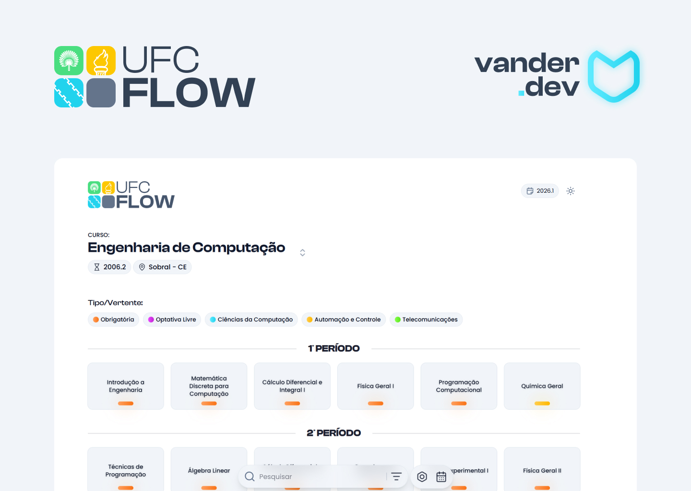

<h1 align="center">
  
</h1>

<h3 align="center">
  🌊 UFC Flow
</h3>

<p align="center">Acompanhe seu fluxo acadêmico de forma interativa, simule sua grade e visualize seus pré-requisitos na UFC.</p>

<p align="center">
  
  
  <a href="https://github.com/vander-furtuna/ufc-flow/commits/master">
    
  </a>

  <a href="https://github.com/vander-furtuna/ufc-flow/issues">
    
  </a>
</p>

## ✅ Sobre o projeto

O **UFC Flow** é uma plataforma web interativa desenvolvida para facilitar a visualização de fluxogramas e matrizes curriculares dos cursos da **Universidade Federal do Ceará (UFC)**. Ela auxilia os discentes a planejarem seu progresso acadêmico, entenderem a malha de pré-requisitos e correquisitos de forma intuitiva, além de simular e montar grades horárias para os semestres seguintes.

O projeto foi construído utilizando tecnologias modernas de desenvolvimento frontend e foi estruturado sob rigorosos princípios de Engenharia de Software e Gerenciamento de Configuração de Software (GCS).

---

## ⚙️ Tecnologias

Tecnologias utilizadas no desenvolvimento da plataforma:

<div align="center"> 
  <div style="display: inline_block"><br>
    
    
    
    
    
  </div>
</div>

---

## ✨ Funcionalidades Principais

- **Visualização Interativa de Fluxogramas**: Renderização dinâmica e interativa das matrizes curriculares usando `@xyflow/react` (React Flow).
- **Simulação de Grade**: Planejamento do próximo semestre com controle automático de pré-requisitos e validação de conflitos de horários.
- **Detalhamento de Disciplinas**: Janelas informativas com código, ementa (quando disponível), carga horária e requisitos.
- **Histórico e Progresso Escolar**: Marcação visual de disciplinas concluídas, em andamento ou planejadas.
- **Modo Escuro & Claro (Dark Mode/Light Mode)**: Suporte completo e dinâmico a temas visuais com `next-themes` e Tailwind CSS.
- **Web Scraping Integrado**: Integração com dados públicos da universidade para extração automatizada de grades e turmas.

---

## 🍞 Como instalar o Bun

O **Bun** é o runtime e gerenciador de pacotes padrão adotado no UFC Flow. Caso você ainda não o tenha instalado em sua máquina, siga as instruções abaixo:

### 🐧 Linux & 🍎 macOS
Você pode instalar o Bun executando o comando oficial de instalação em seu terminal:
```bash
curl -fsSL https://bun.sh/install | bash
```
Após a conclusão, recarregue as configurações do terminal ou execute o comando abaixo para carregar as variáveis de ambiente:
```bash
source ~/.bashrc # ou source ~/.zshrc se usar Zsh
```

### 🪟 Windows
No Windows, você pode instalar o Bun de diferentes maneiras:

1. **Via PowerShell (Recomendado)**:
   Abra o terminal do PowerShell e execute o script oficial de instalação:
   ```powershell
   powershell -c "irm bun.sh/install.ps1 | iex"
   ```
2. **Via Winget**:
   ```powershell
   winget install Oven-Sh.Bun
   ```
3. **Via Scoop**:
   ```powershell
   scoop install bun
   ```
4. **Via Chocolatey**:
   ```powershell
   choco install bun
   ```

### 🔍 Verificando a Instalação
Para confirmar que o Bun foi instalado corretamente, execute o comando:
```bash
bun --version
```
O console deve exibir a versão instalada (ex: `1.1.x` ou superior).

---

## 🚀 Rodando o projeto

Siga as instruções abaixo para executar o projeto localmente.

### 1. Pré‑requisitos

- **Git** instalado em sua máquina.
- **Bun** instalado (veja a seção [Como instalar o Bun](#-como-instalar-o-bun) acima).
- *Alternativa*: Se preferir rodar com **Node.js** (versão ≥ 18), certifique-se de ter o **pnpm** instalado globalmente (`npm install -g pnpm`).

---

### 2. Clonar o repositório

Abra o seu terminal (Bash no Linux ou PowerShell/Git Bash no Windows) e execute:

```bash
git clone https://github.com/vander-furtuna/ufc-flow.git
cd ufc-flow
```

---

### 3. Configurar as variáveis de ambiente

Copie o modelo de variáveis de ambiente [.env.example](file:///c:/Users/furtu/www/react/ufc-flow/.env.example) para criar o seu arquivo local [.env.local](file:///c:/Users/furtu/www/react/ufc-flow/.env.local):

#### 🐧 Linux:
```bash
cp .env.example .env.local
```

#### 🪟 Windows:
```powershell
copy .env.example .env.local
```

Abra o arquivo [.env.local](file:///c:/Users/furtu/www/react/ufc-flow/.env.local) e configure os valores necessários. Exemplo básico:
```env
NEXT_PUBLIC_CURRENT_YEAR=2026
NEXT_PUBLIC_CURRENT_SEMESTER=1
NEXT_PUBLIC_SITE_URL=http://localhost:3000
```

> 💡 **Nota**: O arquivo `.env.local` é ignorado pelo Git (conforme definido no [.gitignore](file:///c:/Users/furtu/www/react/ufc-flow/.gitignore)) para proteger suas credenciais e configurações locais.

---

### 4. Instalar as dependências

#### 🐧 Linux e 🪟 Windows (com Bun - Recomendado):
```bash
bun install
```

#### 🐧 Linux e 🪟 Windows (com PNPM - Alternativo):
```bash
pnpm install
```

---

### 5. Execução em Modo de Desenvolvimento

Para rodar o servidor de desenvolvimento local com hot-reload (recarregamento automático):

#### 🐧 Linux e 🪟 Windows (com Bun):
```bash
bun run dev
```

#### 🐧 Linux e 🪟 Windows (com PNPM):
```bash
pnpm dev
```

Acesse [http://localhost:3000](http://localhost:3000) no seu navegador para visualizar o UFC Flow em funcionamento.

---

### 6. Build e Execução em Produção

Para gerar a build otimizada de produção e iniciar o servidor de alta performance:

#### 🐧 Linux e 🪟 Windows (com Bun):
1. Gerar a build estática otimizada:
   ```bash
   bun run build
   ```
2. Iniciar o servidor de produção:
   ```bash
   bun start
   ```

#### 🐧 Linux e 🪟 Windows (com PNPM):
1. Gerar a build estática otimizada:
   ```bash
   pnpm build
   ```
2. Iniciar o servidor de produção:
   ```bash
   pnpm start
   ```

Por padrão, a aplicação de produção estará disponível em [http://localhost:3000](http://localhost:3000).

---

## 🛠️ Qualidade de Código & CI (Integração Contínua)

O repositório possui fluxos de validação de qualidade de código automatizados via GitHub Actions (definidos em [.github/workflows/ci.yml](file:///c:/Users/furtu/www/react/ufc-flow/.github/workflows/ci.yml)). Antes de enviar qualquer alteração, é altamente recomendado rodar localmente os seguintes comandos para garantir a conformidade:

1. **Linting (Linter)**: Corrige e avisa sobre desvios nos padrões de estilo de código:
   ```bash
   bun run lint
   # ou pnpm lint
   ```
2. **Typecheck (TypeScript)**: Valida os tipos estáticos de toda a base de código:
   ```bash
   bun x tsc --noEmit
   # ou pnpm tsc --noEmit
   ```
3. **Build local**: Verifica se o processo de compilação encerra com sucesso:
   ```bash
   bun run build
   # ou pnpm build
   ```

---

## 📄 Gerenciamento de Configuração & Controle de Mudanças

Este projeto segue formalidades rígidas de GCS, documentadas no [PLANO_GERENCIAMENTO_CONFIGURACAO.md](file:///c:/Users/furtu/www/react/ufc-flow/PLANO_GERENCIAMENTO_CONFIGURACAO.md). 
- **Commits**: Seguem a especificação de **Conventional Commits** (ex: `feat(agenda): adiciona popup de detalhes`).
- **Branches**: Adota o GitFlow simplificado, onde toda mudança entra via Pull Request (PR) na branch `develop` antes de ser congelada e enviada para a branch `master` sob uma tag versionada.
- **Itens de Configuração (ICs)**: Mapeados detalhadamente no documento [CONFIGURATION_ITEMS.md](file:///c:/Users/furtu/www/react/ufc-flow/CONFIGURATION_ITEMS.md).

---

Desenvolvido com 💙 para a comunidade acadêmica da **Universidade Federal do Ceará**.
